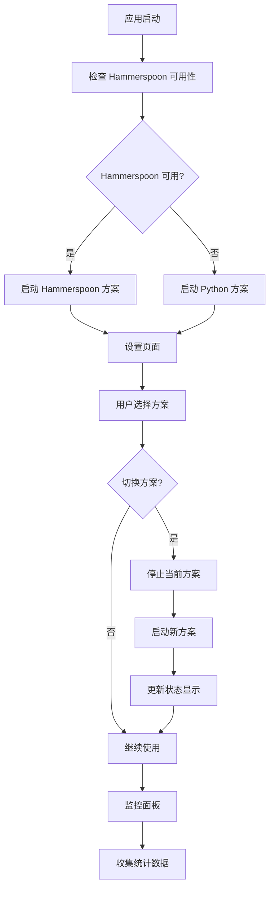

# 双热键方案架构设计文档

## 1. 产品概述

为语音转文本应用设计双热键监听方案架构，支持用户在设置中切换 Hammerspoon 方案和 Python 原生方案，以对比两种方案的稳定性表现。

* 解决 macOS 平台全局热键稳定性问题，提供更可靠的热键监听机制

* 允许用户根据实际使用体验选择最适合的热键方案

* 为后续性能优化和稳定性改进提供数据支撑

## 2. 核心功能

### 2.1 用户角色

| 角色   | 注册方式   | 核心权限              |
| ---- | ------ | ----------------- |
| 普通用户 | 直接使用应用 | 可选择热键方案、使用语音转文本功能 |

### 2.2 功能模块

我们的双热键架构需求包含以下主要页面：

1. **设置页面**：热键方案选择、方案配置、稳定性统计
2. **主界面**：语音录制控制、热键状态显示、方案切换提示
3. **监控面板**：热键状态监控、错误日志、性能统计

### 2.3 页面详情

| 页面名称 | 模块名称   | 功能描述                                               |
| ---- | ------ | -------------------------------------------------- |
| 设置页面 | 热键方案选择 | 提供 Hammerspoon 和 Python 两种方案的单选按钮，默认选择 Hammerspoon |
| 设置页面 | 方案配置   | 根据选择的方案显示对应的配置选项（热键类型、延迟设置等）                       |
| 设置页面 | 稳定性统计  | 显示两种方案的使用时长、错误次数、重启次数等统计信息                         |
| 主界面  | 热键状态指示 | 实时显示当前使用的热键方案和连接状态                                 |
| 主界面  | 方案切换提示 | 当方案切换时显示提示信息，确认用户操作                                |
| 监控面板 | 实时状态监控 | 显示热键监听状态、响应时间、CPU 使用率                              |
| 监控面板 | 错误日志   | 记录和显示热键失效、重启等事件的详细日志                               |
| 监控面板 | 性能对比   | 提供两种方案的性能对比图表和统计数据                                 |

## 3. 核心流程

### 用户操作流程

用户首次启动应用时，系统默认使用 Hammerspoon 方案。用户可以通过设置页面切换到 Python 方案，系统会自动停止当前方案并启动新方案。在使用过程中，监控面板会实时收集两种方案的稳定性数据，用户可以根据统计信息选择最适合的方案。

## 4. 用户界面设计

### 4.1 设计风格

* 主色调：#2196F3（蓝色）、#4CAF50（绿色表示稳定）

* 按钮样式：圆角矩形，3D 效果，悬停时有阴影

* 字体：系统默认字体，标题 16px，正文 14px

* 布局风格：卡片式布局，顶部导航栏

* 图标风格：线性图标，配合状态颜色（绿色=正常，红色=异常，黄色=警告）

### 4.2 页面设计概览

| 页面名称 | 模块名称   | UI 元素       |
| ---- | ------ | ----------- |
| 设置页面 | 热键方案选择 | 单选按钮组，方案名称， |

