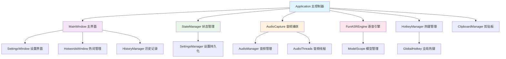
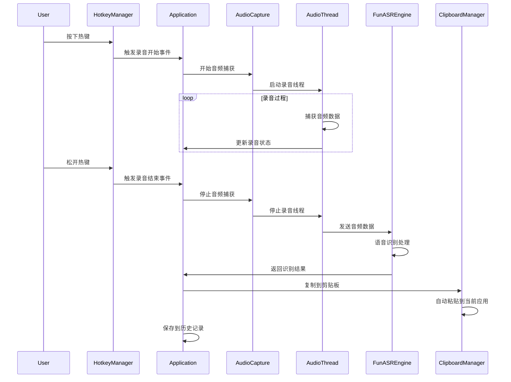
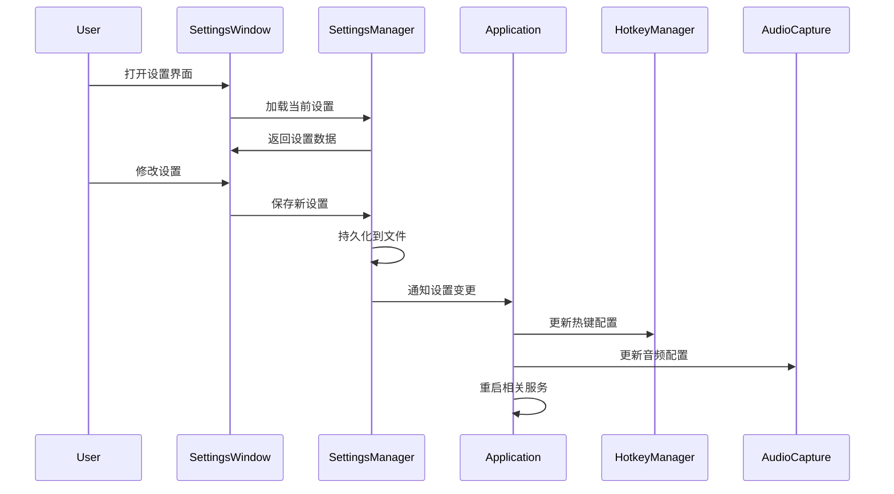

# Wispr Flow CN 项目架构文档

## 1. 架构概览

### 1.1 整体架构

Wispr Flow CN 采用模块化的 MVC 架构模式，主要分为以下几个层次：

```
┌─────────────────────────────────────────────────────────┐
│                    用户界面层 (UI Layer)                    │
├─────────────────────────────────────────────────────────┤
│                   业务逻辑层 (Business Layer)               │
├─────────────────────────────────────────────────────────┤
│                   数据访问层 (Data Layer)                  │
├─────────────────────────────────────────────────────────┤
│                   系统集成层 (System Layer)                │
└─────────────────────────────────────────────────────────┘
```

### 1.2 核心组件关系



## 2. 核心模块详解

### 2.1 应用控制层

#### Application 类 (`main.py`)

**职责**: 应用程序的主控制器和生命周期管理

**核心功能**:

* 应用程序初始化和资源管理

* 系统托盘集成和菜单管理

* 异步组件初始化

* 全局异常处理和日志记录

* 各子系统的协调和通信

**关键方法**:

```python
class Application(QObject):
    def __init__(self)                    # 应用初始化
    def _start_background_initialization() # 异步初始化
    def _async_initialization_step()       # 分步初始化
    def handle_recording_start()          # 录音开始处理
    def handle_recording_stop()           # 录音结束处理
    def cleanup_resources()               # 资源清理
```

### 2.2 用户界面层

#### MainWindow 类 (`ui/main_window.py`)

**职责**: 主用户界面和用户交互

**核心功能**:

* 现代化无边框窗口设计

* 录音状态显示和控制

* 历史记录展示和管理

* 窗口拖拽和位置记忆

* 快捷键绑定和响应

**UI 组件结构**:

```
MainWindow
├── TitleBar (标题栏)
│   ├── AppIcon (应用图标)
│   ├── WindowTitle (窗口标题)
│   └── WindowControls (窗口控制按钮)
├── ContentArea (内容区域)
│   ├── StatusIndicator (状态指示器)
│   ├── RecordButton (录音按钮)
│   └── HistoryList (历史记录列表)
└── BottomBar (底部栏)
    ├── SettingsButton (设置按钮)
    └── StatusText (状态文本)
```

#### SettingsWindow 类 (`ui/settings_window.py`)

**职责**: 应用设置和配置管理界面

**功能模块**:

* 快捷键配置面板

* 音频参数设置

* FunASR 模型配置

* 界面主题设置

* 权限检查和引导

### 2.3 音频处理层

#### AudioCapture 类 (`audio_capture.py`)

**职责**: 音频设备管理和音频流捕获

**核心功能**:

```python
class AudioCapture:
    def __init__(self)                    # 初始化音频设备
    def start_recording(self)             # 开始录音
    def stop_recording(self)              # 停止录音
    def get_audio_data(self)              # 获取音频数据
    def set_audio_params(self, params)    # 设置音频参数
    def check_audio_devices(self)         # 检查音频设备
```

#### AudioManager 类 (`audio_manager.py`)

**职责**: 音频处理和优化

**处理流程**:

1. 音频数据预处理（降噪、归一化）
2. 音频格式转换（采样率、位深度）
3. 音频质量检测（音量、静音检测）
4. 音频缓冲区管理

#### AudioThreads 模块 (`audio_threads.py`)

**职责**: 多线程音频处理

**线程架构**:

```python
class AudioCaptureThread(QThread):     # 音频捕获线程
class TranscriptionThread(QThread):    # 转录处理线程
class AudioProcessingThread(QThread):  # 音频预处理线程
```

### 2.4 语音识别层

#### FunASREngine 类 (`funasr_engine.py`)

**职责**: FunASR 模型管理和语音识别

**核心架构**:

```python
class FunASREngine:
    def __init__(self)                    # 模型初始化
    def load_model(self, model_name)      # 加载指定模型
    def transcribe(self, audio_data)      # 语音转文字
    def set_hotwords(self, hotwords)      # 设置热词
    def optimize_model(self)              # 模型优化
    def cleanup(self)                     # 资源清理
```

**模型管理**:

* 支持多种 FunASR 预训练模型

* 模型量化和优化

* 热词动态加载

* 内存使用优化

### 2.5 系统集成层

#### HotkeyManager 类 (`hotkey_manager.py`)

**职责**: 热键监听和处理

**功能特性**:

```python
class HotkeyManager:
    def start_listening(self)             # 开始监听
    def stop_listening(self)              # 停止监听
    def register_hotkey(self, key, callback) # 注册热键
    def check_permissions(self)           # 检查权限
```

#### GlobalHotkey 类 (`global_hotkey.py`)

**职责**: macOS 全局热键集成

**系统集成**:

* macOS 辅助功能权限检查

* 系统级热键监听

* 热键冲突检测和处理

* 权限引导和错误处理

#### ClipboardManager 类 (`clipboard_manager.py`)

**职责**: 剪贴板操作和自动粘贴

**核心功能**:

```python
class ClipboardManager:
    def copy_to_clipboard(self, text)     # 复制到剪贴板
    def paste_to_current_app(self)        # 粘贴到当前应用
    def get_clipboard_content(self)       # 获取剪贴板内容
    def monitor_clipboard(self)           # 监控剪贴板变化
```

### 2.6 状态管理层

#### StateManager 类 (`state_manager.py`)

**职责**: 应用状态管理和同步

**状态类型**:

```python
graph TB
    A[Application 主控制器] --> B[MainWindow 主界面]
    A --> C[StateManager 状态管理]
    A --> D[AudioCapture 音频捕获]
    A --> E[FunASREngine 语音引擎]
    A --> F[HotkeyManager 热键管理]
    A --> G[ClipboardManager 剪贴板]
    
    B --> H[SettingsWindow 设置界面]
    B --> I[HotwordsWindow 热词管理]
    B --> J[HistoryManager 历史记录]
    
    C --> K[SettingsManager 设置持久化]
    D --> L[AudioManager 音频管理]
    D --> M[AudioThreads 音频线程]
    
    E --> N[ModelScope 模型管理]
    F --> O[GlobalHotkey 全局热键]
    
    style A fill:#e1f5fe
    style B fill:#f3e5f5
    style C fill:#e8f5e8
    style D fill:#fff3e0
    style E fill:#fce4ec
```

**状态管理**:

* 状态变更通知

* 状态持久化

* 状态恢复机制

* 状态同步和一致性

#### SettingsManager 类 (`settings_manager.py`)

**职责**: 设置持久化和配置管理

**配置结构**:

```json
{
  "hotkey": {
    "primary_key": "option",
    "modifiers": []
  },
  "audio": {
    "sample_rate": 16000,
    "channels": 1,
    "buffer_size": 1024
  },
  "funasr": {
    "model_name": "paraformer-zh",
    "use_quantization": true,
    "hotwords": []
  }
}
```

## 3. 数据流架构

### 3.1 录音到转录流程



### 3.2 设置配置流程



## 4. 错误处理和日志

### 4.1 异常处理架构

```python
# 全局异常处理器
class GlobalExceptionHandler:
    def handle_audio_error(self, error)      # 音频错误处理
    def handle_recognition_error(self, error) # 识别错误处理
    def handle_permission_error(self, error)  # 权限错误处理
    def handle_system_error(self, error)     # 系统错误处理
```

### 4.2 日志系统

**日志级别**:

* `DEBUG`: 详细调试信息

* `INFO`: 一般信息记录

* `WARNING`: 警告信息

* `ERROR`: 错误信息

* `CRITICAL`: 严重错误

**日志文件结构**:

```
logs/
├── app_20241201_143022.log    # 应用主日志
├── audio_20241201_143022.log  # 音频模块日志
├── funasr_20241201_143022.log # 识别引擎日志
└── error_20241201_143022.log  # 错误日志
```

## 5. 性能优化策略

### 5.1 内存优化

* **模型量化**: FunASR 模型使用 INT8 量化

* **音频缓冲**: 动态调整缓冲区大小

* **资源回收**: 及时释放不用的音频数据

* **对象池**: 重用音频处理对象

### 5.2 启动优化

* **异步初始化**: 分步加载重型组件

* **延迟加载**: 按需加载 FunASR 模型

* **缓存机制**: 缓存模型和配置数据

* **预热策略**: 预加载常用组件

### 5.3 响应性优化

* **多线程处理**: 音频捕获和识别分离

* **非阻塞 UI**: 避免 UI 线程阻塞

* **优先级调度**: 关键任务优先处理

* **批处理**: 批量处理音频数据

## 6. 扩展性设计

### 6.1 插件架构

```python
class PluginInterface:
    def initialize(self)                  # 插件初始化
    def process_audio(self, audio_data)   # 音频处理钩子
    def process_text(self, text)          # 文本处理钩子
    def cleanup(self)                     # 插件清理
```

### 6.2 模型扩展

* **多模型支持**: 支持不同的语音识别模型

* **模型切换**: 运行时动态切换模型

* **自定义模型**: 支持用户自定义模型

* **模型更新**: 在线模型更新机制

### 6.3 平台扩展

* **跨平台抽象**: 系统相关功能抽象化

* **平台适配器**: 不同平台的具体实现

* **配置隔离**: 平台特定配置分离

* **功能检测**: 运行时平台功能检测

***

*架构文档版本: 1.0*\
*最后更新: 2024年12月*\
*维护者: ttmouse*
