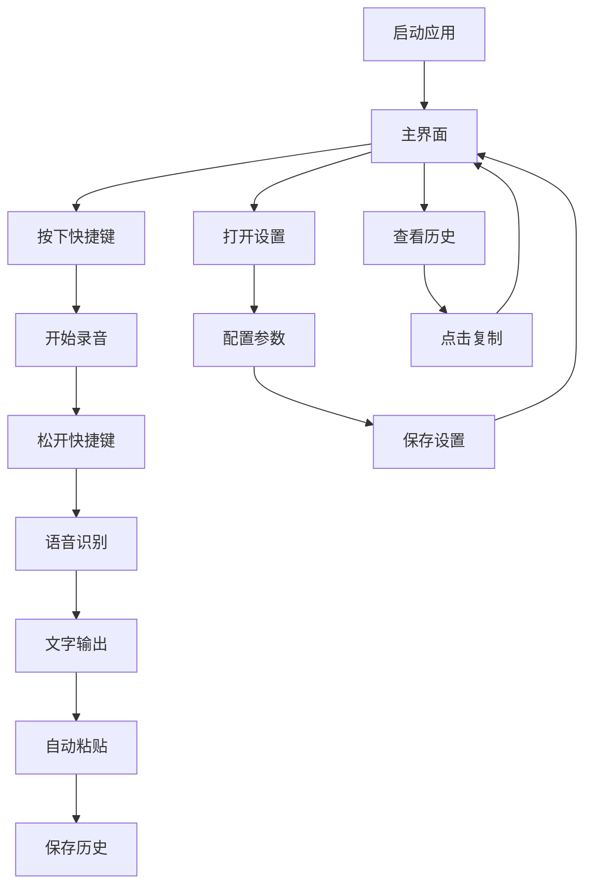

# Wispr Flow CN 项目文档更新报告

## 1. 项目概述

**Wispr Flow CN (Dou-flow)** 是一个基于 FunASR 的 macOS 语音转文字应用程序，支持全局快捷键录音、实时语音识别和自动文本粘贴功能。项目采用 PyQt6 构建现代化用户界面，提供离线语音识别能力。

- **目标用户**: macOS 用户，需要快速语音输入功能
- **核心价值**: 提供流畅的语音转文字体验，支持中文优化识别
- **技术特色**: 基于 FunASR 的离线识别，无需网络连接

## 2. 核心功能

### 2.1 用户角色

| 角色 | 访问方式 | 核心权限 |
|------|----------|----------|
| 默认用户 | 直接启动应用 | 可使用所有语音转文字功能、设置快捷键、查看历史记录 |

### 2.2 功能模块

项目包含以下核心页面和功能：

1. **主界面**: 录音状态显示、历史记录列表、录音控制按钮
2. **设置界面**: 快捷键配置、音频参数调整、模型设置
3. **热词管理界面**: 自定义词典、热词添加和管理
4. **系统托盘**: 快速访问、状态监控、应用控制

### 2.3 页面详情

| 页面名称 | 模块名称 | 功能描述 |
|----------|----------|----------|
| 主界面 | 录音控制 | 提供录音按钮，显示录音状态，支持快捷键触发 |
| 主界面 | 历史记录 | 显示转录历史，支持点击复制，提供搜索功能 |
| 主界面 | 状态显示 | 实时显示录音状态、热键状态、引擎状态 |
| 设置界面 | 快捷键配置 | 自定义全局快捷键，支持组合键设置 |
| 设置界面 | 音频设置 | 调整音频采样率、缓冲区大小、音量阈值 |
| 设置界面 | 模型配置 | 选择 FunASR 模型，配置识别参数 |
| 热词管理 | 词典管理 | 添加、删除、编辑自定义热词和专业术语 |
| 系统托盘 | 快速操作 | 显示/隐藏窗口、重启热键、检查权限、退出应用 |

## 3. 核心流程

### 3.1 主要用户操作流程

**语音转文字流程**:
1. 用户按下全局快捷键（默认 Option 键）开始录音
2. 系统捕获音频并实时显示录音状态
3. 用户松开快捷键，停止录音
4. FunASR 引擎处理音频并生成文字
5. 文字自动复制到剪贴板并粘贴到当前应用
6. 转录结果保存到历史记录

**设置配置流程**:
1. 用户通过托盘菜单或快捷键打开设置界面
2. 配置快捷键、音频参数、模型选项
3. 保存设置并重启相关服务
4. 验证配置是否生效



## 4. 用户界面设计

### 4.1 设计风格

- **主色调**: 白色背景 (#FFFFFF)，灰色文字 (#999999)
- **按钮样式**: 现代化圆角按钮，支持悬停效果
- **字体**: 系统默认字体，14px 标准大小
- **布局风格**: 卡片式布局，顶部导航，无边框窗口
- **图标风格**: 简洁的单色图标，支持系统主题

### 4.2 页面设计概览

| 页面名称 | 模块名称 | UI 元素 |
|----------|----------|----------|
| 主界面 | 标题栏 | 无边框设计，拖拽区域，最小化/关闭按钮 |
| 主界面 | 录音区域 | 大型录音按钮，状态指示器，音量可视化 |
| 主界面 | 历史列表 | 现代化列表组件，时间戳，文字预览 |
| 设置界面 | 选项卡 | 分类设置面板，实时预览，保存按钮 |
| 托盘图标 | 菜单 | 上下文菜单，状态指示，快速操作 |

### 4.3 响应式设计

- **平台**: macOS 桌面应用，固定窗口大小
- **最小尺寸**: 400x600 像素
- **交互优化**: 支持键盘快捷键，鼠标悬停效果
- **可访问性**: 支持 VoiceOver，键盘导航

## 5. 技术架构

### 5.1 技术栈

**核心框架**:
- **UI 框架**: PyQt6 6.4.0+
- **语音识别**: FunASR (ModelScope)
- **音频处理**: PyAudio, torchaudio
- **系统集成**: pyobjc (macOS 原生 API)

**主要依赖**:
- **深度学习**: torch, numpy
- **系统交互**: pynput (全局热键), pyperclip (剪贴板)
- **打包工具**: PyInstaller
- **文件监控**: watchdog

### 5.2 项目结构

```
ASR-FunASR/
├── src/                          # 源代码目录
│   ├── main.py                   # 主应用程序入口
│   ├── config.py                 # 配置管理
│   ├── constants.py              # 常量定义
│   ├── audio_capture.py          # 音频捕获
│   ├── audio_manager.py          # 音频管理
│   ├── audio_threads.py          # 音频线程处理
│   ├── funasr_engine.py          # FunASR 引擎
│   ├── hotkey_manager.py         # 热键管理
│   ├── global_hotkey.py          # 全局热键
│   ├── clipboard_manager.py      # 剪贴板管理
│   ├── state_manager.py          # 状态管理
│   ├── context_manager.py        # 上下文管理
│   ├── settings_manager.py       # 设置管理
│   ├── resource_utils.py         # 资源工具
│   └── ui/                       # 用户界面
│       ├── main_window.py        # 主窗口
│       ├── settings_window.py    # 设置窗口
│       ├── hotwords_window.py    # 热词管理
│       ├── menu_manager.py       # 菜单管理
│       └── components/           # UI 组件
├── requirements.txt              # 依赖列表
├── iconset.icns                 # 应用图标
├── history.json                 # 历史记录
└── logs/                        # 日志文件
```

### 5.3 核心组件

**Application 类** (`main.py`):
- 应用程序主控制器，管理所有子系统
- 处理系统托盘、窗口管理、异步初始化
- 协调音频捕获、语音识别、文本输出流程

**FunASREngine 类** (`funasr_engine.py`):
- 封装 FunASR 模型加载和推理
- 支持热词、量化优化、资源管理
- 提供异步转录接口

**AudioCapture 类** (`audio_capture.py`):
- 基于 PyAudio 的音频捕获
- 支持实时音频流处理
- 音量检测和噪声过滤

**HotkeyManager 类** (`hotkey_manager.py`):
- 全局快捷键监听和处理
- 支持组合键配置
- macOS 权限检查和错误处理

## 6. 部署和维护

### 6.1 开发环境

```bash
# 安装依赖
pip install -r requirements.txt

# 运行应用
python src/main.py
```

### 6.2 打包发布

```bash
# 使用 PyInstaller 打包
pyinstaller --windowed --onefile --icon=iconset.icns src/main.py
```

### 6.3 系统要求

- **操作系统**: macOS 10.14+
- **Python**: 3.8+
- **内存**: 最少 4GB RAM
- **存储**: 2GB 可用空间（包含模型文件）
- **权限**: 麦克风访问权限、辅助功能权限

## 7. 更新记录

### 版本 1.1.39 (当前版本)

**新增功能**:
- 优化的 FunASR 引擎集成
- 现代化 UI 设计
- 改进的热键管理系统
- 历史记录持久化
- 系统托盘支持

**技术改进**:
- 异步初始化减少启动时间
- 内存优化和资源管理
- 错误处理和日志系统
- 模块化架构设计

**已知问题**:
- 部分 macOS 版本的热键权限问题
- 长时间运行的内存占用优化
- FunASR 模型加载时间较长

## 8. 后续规划

### 8.1 短期目标
- 优化启动速度和内存使用
- 完善错误处理和用户反馈
- 增加更多语言模型支持
- 改进热键权限检查机制

### 8.2 长期目标
- 支持实时流式识别
- 添加语音命令功能
- 云端模型同步
- 多平台支持（Windows, Linux）

---

*文档更新时间: 2024年12月*  
*项目版本: 1.1.39*  
*维护者: ttmouse*