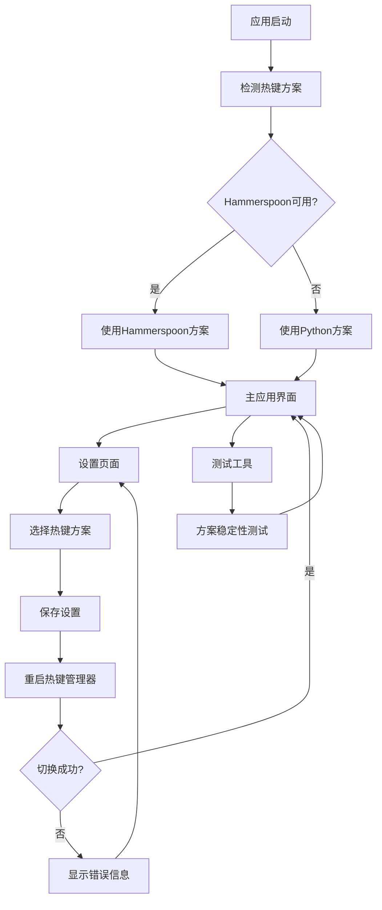

# 双热键方案产品需求文档

## 1. 产品概述

本项目为ASR-FunASR语音识别应用实现了双热键监听方案，支持Hammerspoon和Python两种热键监听技术的动态切换。用户可以根据系统环境和稳定性需求在设置界面中选择最适合的热键方案，默认优先使用Hammerspoon方案以获得更好的系统级热键监听体验。

该功能解决了单一热键方案可能存在的兼容性和稳定性问题，为不同用户环境提供了灵活的解决方案，提升了应用的整体可用性和用户体验。

## 2. 核心功能

### 2.1 用户角色

本功能不涉及用户角色区分，所有用户均可使用热键方案切换功能。

### 2.2 功能模块

我们的双热键方案需求包含以下主要页面：

1. **设置页面**：热键方案选择组件、方案状态显示、切换确认机制
2. **主应用界面**：热键状态指示器、方案运行状态显示
3. **测试工具界面**：方案可用性检测、切换测试、稳定性验证

### 2.3 页面详情

| 页面名称 | 模块名称 | 功能描述 |
|---------|---------|----------|
| 设置页面 | 热键方案选择 | 提供下拉菜单选择Hammerspoon或Python方案，显示方案描述和推荐状态 |
| 设置页面 | 方案状态显示 | 实时显示当前使用的热键方案和运行状态 |
| 设置页面 | 切换确认机制 | 检测方案变化并自动重启热键管理器，提供切换成功/失败反馈 |
| 主应用界面 | 热键状态指示器 | 在系统托盘或主界面显示当前热键方案和监听状态 |
| 主应用界面 | 方案运行监控 | 监控热键方案运行状态，出现异常时提供错误信息和重试选项 |
| 测试工具界面 | 方案可用性检测 | 检测系统中Hammerspoon和Python方案的可用性 |
| 测试工具界面 | 切换测试功能 | 自动测试两种方案的切换过程和稳定性 |

## 3. 核心流程

**主要用户操作流程：**

1. 用户启动应用时，系统自动检测可用的热键方案
2. 优先尝试使用Hammerspoon方案，如不可用则自动回退到Python方案
3. 用户可在设置页面查看当前使用的方案和可用方案列表
4. 用户选择不同方案时，系统保存设置并重启热键管理器
5. 系统验证新方案是否正常工作，如失败则回退到之前的方案
6. 用户可使用测试工具验证两种方案的稳定性和性能

**页面导航流程图：**

## 4. 用户界面设计

### 4.1 设计风格

- **主色调**：深蓝色 (#2C3E50) 和浅灰色 (#ECF0F1)
- **辅助色**：绿色 (#27AE60) 表示正常状态，橙色 (#F39C12) 表示警告，红色 (#E74C3C) 表示错误
- **按钮样式**：圆角矩形按钮，3px圆角，渐变背景
- **字体**：系统默认字体，标题14px，正文12px，说明文字10px
- **布局风格**：卡片式布局，清晰的分组和间距
- **图标风格**：简洁的线性图标，配合状态颜色

### 4.2 页面设计概览

| 页面名称 | 模块名称 | UI元素 |
|---------|---------|--------|
| 设置页面 | 热键方案选择 | 下拉选择框，方案名称和描述文字，推荐标签(绿色背景) |
| 设置页面 | 方案状态显示 | 状态指示灯(绿/橙/红)，当前方案文字，运行时长显示 |
| 设置页面 | 切换确认机制 | 保存按钮(蓝色渐变)，进度条，成功/失败提示框 |
| 主应用界面 | 热键状态指示器 | 托盘图标颜色变化，悬停提示显示方案信息 |
| 主应用界面 | 方案运行监控 | 小型状态面板，错误计数器，重试按钮 |
| 测试工具界面 | 方案检测结果 | 表格形式显示，可用性图标，详细信息展开 |
| 测试工具界面 | 测试控制面板 | 开始测试按钮，进度条，实时日志输出区域 |

### 4.3 响应式设计

本应用主要为桌面端设计，采用固定窗口大小，确保在不同分辨率下的一致性体验。设置窗口支持最小尺寸限制，保证所有控件的可用性。测试工具界面支持窗口缩放，日志输出区域可自适应调整大小。
