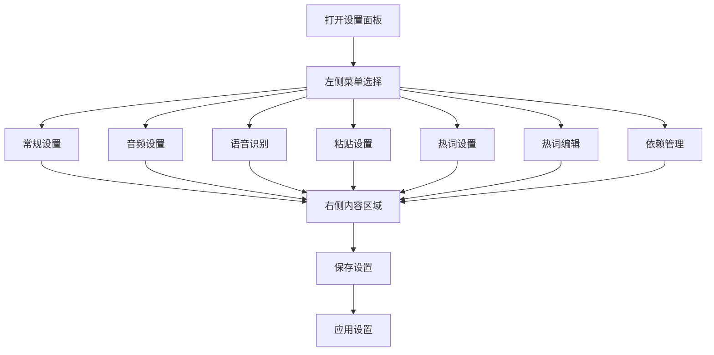

## macOS风格设置面板改造需求

### 1. 产品概述

将现有的标签页式设置面板改造为类似macOS系统设置的左侧菜单布局，提升用户体验和界面美观度。

### 2. 核心功能

#### 2.1 用户角色

无需区分用户角色，所有用户均可访问设置面板。

#### 2.2 功能模块

设置面板包含以下主要页面：

1. **常规设置页面**：热键方案设置、快捷键设置、快捷键延迟设置
2. **音频设置页面**：音频设备选择、音频控制参数
3. **语音识别页面**：ASR模型设置、标点符号设置
4. **粘贴设置页面**：粘贴延迟配置
5. **热词设置页面**：热词权重、发音纠正设置
6. **热词编辑页面**：热词列表管理
7. **依赖管理页面**：系统依赖检查和管理

#### 2.3 页面详情

| 页面名称 | 模块名称    | 功能描述                       |
| ---- | ------- | -------------------------- |
| 常规设置 | 热键方案设置  | 选择hammerspoon或python热键监听方案 |
| 常规设置 | 快捷键设置   | 配置录音快捷键（fn/ctrl/alt）       |
| 常规设置 | 快捷键延迟设置 | 设置录制启动延迟时间                 |
| 音频设置 | 音频设备    | 选择麦克风输入设备，支持设备刷新           |
| 音频设置 | 音频控制    | 配置音量阈值和录音时长限制              |
| 语音识别 | 模型设置    | 配置ASR模型路径和标点模型路径           |
| 语音识别 | 标点设置    | 启用/禁用自动标点功能                |
| 粘贴设置 | 粘贴延迟    | 设置转录完成后和历史记录点击的粘贴延迟        |
| 热词设置 | 热词权重    | 调整热词识别权重（10-100）           |
| 热词设置 | 发音纠正    | 启用/禁用发音纠正功能                |
| 热词编辑 | 热词管理    | 编辑、添加、删除热词列表               |
| 依赖管理 | 系统检查    | 检查和管理系统依赖项                 |

### 3. 核心流程

用户打开设置面板 → 在左侧菜单选择设置类别 → 在右侧内容区域进行具体设置 → 保存设置并应用

### 4. 用户界面设计

#### 4.1 设计风格

* **主色调**：浅灰色背景 (#f5f5f5)，白色内容区域

* **次要色调**：蓝色选中状态 (#007AFF)，深灰色文字 (#333333)

* **按钮样式**：圆角矩形，扁平化设计

* **字体**：系统默认字体，标题14px，正文12px

* **布局风格**：左侧固定宽度菜单栏，右侧自适应内容区域

* **图标风格**：简洁的线性图标或系统图标

#### 4.2 页面设计概览

| 页面名称 | 模块名称 | UI元素    |
| ---- | ---- | ------- |
| 左侧菜单 | 菜单列表 | 固定宽度200 |

