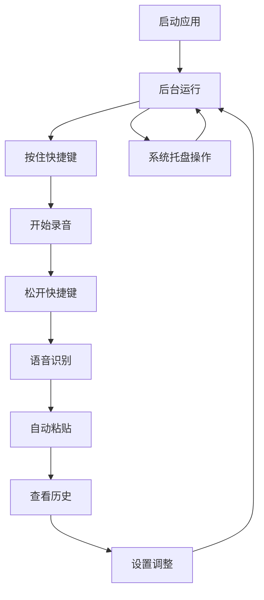

# Wispr Flow CN (Dou-flow) 产品需求文档

## 1. 产品概述

基于 FunASR 的 macOS 语音转文字应用程序，支持全局快捷键录音和自动文本粘贴。通过按住快捷键进行语音录制，松开后自动识别并将结果粘贴到当前应用中，提供高效的语音输入体验。

产品采用离线模式运行，保护用户隐私安全，支持中文高精度识别，适用于文档编辑、聊天输入、代码注释等多种场景。

## 2. 核心功能

### 2.1 用户角色

本产品为单用户桌面应用，无需注册登录，所有用户均可直接使用全部功能。

### 2.2 功能模块

我们的语音转文字应用包含以下主要页面：

1. **主窗口页面**：历史记录展示、状态监控、快速操作入口
2. **设置页面**：快捷键配置、音频参数、识别设置、热词管理
3. **热词编辑页面**：自定义词典管理、专业术语配置
4. **系统托盘**：后台运行控制、快速访问功能

### 2.3 页面详情

| 页面名称   | 模块名称   | 功能描述                                          |
| ------ | ------ | --------------------------------------------- |
| 主窗口页面  | 历史记录列表 | 显示所有转录历史，支持时间戳、点击复制、搜索过滤                      |
| 主窗口页面  | 状态指示器  | 实时显示录音状态、识别进度、热键监听状态                          |
| 主窗口页面  | 快速操作栏  | 提供设置入口、清空历史、手动录音等功能                           |
| 设置页面   | 常规设置   | 快捷键配置（fn/ctrl/alt）、热键方案选择（Hammerspoon/Python） |
| 设置页面   | 音频设置   | 输入设备选择、音量阈值调节、录音时长限制                          |
| 设置页面   | 语音识别设置 | 模型路径配置、自动标点开关、实时显示控制                          |
| 设置页面   | 粘贴设置   | 转录延迟调节、历史点击延迟、快捷键响应延迟                         |
| 设置页面   | 热词设置   | 热词权重调节、发音纠正开关                                 |
| 热词编辑页面 | 热词列表管理 | 添加、删除、编辑自定义热词，支持批量导入导出                        |
| 热词编辑页面 | 专业词典   | 预设专业领域词典，提高特定场景识别准确率                          |
| 系统托盘   | 快速控制   | 显示/隐藏主窗口、开始/停止录音、退出应用                         |
| 系统托盘   | 状态监控   | 托盘图标变化反映当前工作状态                                |

## 3. 核心流程

**主要用户操作流程：**

1. **启动应用** → 应用在后台运行，托盘显示状态图标
2. **按住快捷键** → 开始录音，状态指示器显示录音中
3. **松开快捷键** → 停止录音，自动进行语音识别
4. **获取结果** → 识别文本自动复制到剪贴板并粘贴到当前应用
5. **查看历史** → 在主窗口查看所有转录记录，支持重新复制
6. **调整设置** → 通过设置页面优化识别效果和使用体验

## 4. 用户界面设计

### 4.1 设计风格

* **主色调**：深色主题，主色 #2D3748，辅助色 #4A5568

* **按钮样式**：圆角矩形按钮，悬停效果明显

* **字体**：系统默认字体，标题 16px，正文 14px，小字 12px

* **布局风格**：卡片式布局，顶部导航，简洁现代

* **图标风格**：线性图标，统一风格，支持状态变化动画

### 4.2 页面设计概览

| 页面名称   | 模块名称   | UI元素                          |
| ------ | ------ | ----------------------------- |
| 主窗口页面  | 历史记录列表 | 卡片式列表，时间戳左对齐，文本内容可选择，悬停显示复制按钮 |
| 主窗口页面  | 状态指示器  | 顶部状态栏，录音时红色脉冲动画，识别时蓝色进度条      |
| 设置页面   | 标签页布局  | 左侧标签导航，右侧内容区域，表单元素统一间距        |
| 设置页面   | 控件样式   | 下拉框、滑块、开关按钮，实时预览效果            |
| 热词编辑页面 | 编辑界面   | 文本框支持多行输入，添加/删除按钮，实时保存提示      |
| 系统托盘   | 图标设计   | 麦克风图标，状态颜色变化：灰色待机、红色录音、蓝色识别   |

### 4.3 响应式设计

桌面优先设计，主窗口支持最小化到托盘，设置窗口采用固定尺寸，确保在不同分辨率下的一致体验。支持键盘快捷键操作，优化无障碍访问。

## 5. 功能规划与改进

### 5.1 当前已知问题

1. **开发模式输入问题**：python src/main.py 运行时，设置面板的输入框无法正常输入（如热词编辑）
2. **设置项简化**：部分自动生成的设置选项可能无实际功能，需要清理以保持界面简洁
3. **响应延迟优化**：Hammerspoon热键方案可能提升响应速度，需要验证效果

### 5.2 未来功能规划

1. **AI翻译集成**：语音转文本后支持翻译功能，对接DeepSeek等AI API
2. **多语言支持**：扩展支持英文、日文等其他语言的语音识别
3. **云端同步**：支持历史记录和设置的云端备份同步
4. **快捷指令**：支持语音指令触发特定操作（如"复制上一条"）

### 5.3 设计原则

**奥卡姆剃刀原理**：如无必要，勿增实体。保持功能精简，避免冗余设置，专注核心语音转文字体验。

## 6. 开发日志

### 2025-07-23 22:57:28 - 热键架构优化

* 考虑将热键监听改为Hammerspoon方案，提升系统稳定性

* 探索其他模块的重构可能性，增强整体架构稳健性

### 2025-07-23 23:00:47 - 响应性能分析

* Hammerspoon热键方案可能改善响应延迟问题

* 当前快捷键响应存在轻微延迟，需要性能优化

### 2025-07-23 23:07:29 - 设置界面简化

* 识别到部分设置选项可能为冗余功能：

  * 自动添加标点

  * 实时显示识别结果

* 需要验证功能有效性，移除无用选项保持界面简洁

* 录制效果测试进行中

