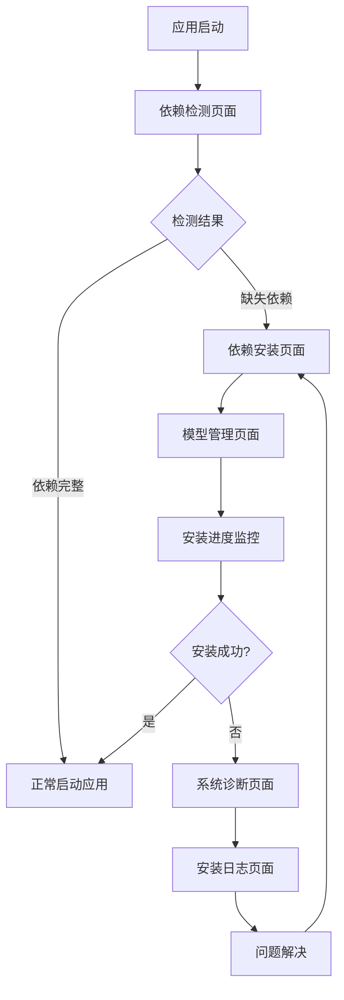

# 应用依赖管理系统需求文档

## 1. 产品概述

本文档定义了ASR-FunASR应用的依赖管理系统，旨在为打包后的应用提供自动检测、下载和安装依赖的能力，确保用户在任何环境下都能顺利使用应用。

该系统解决了应用分发时的环境配置问题，让用户无需手动安装复杂的依赖环境，通过图形界面即可完成所有必要组件的安装。

## 2. 核心功能

### 2.1 用户角色

| 角色 | 描述 | 核心权限 |
|------|------|----------|
| 终端用户 | 接收打包应用的普通用户 | 可检测依赖状态、安装缺失组件、查看安装进度 |
| 开发者 | 应用开发和维护人员 | 可配置依赖检测规则、更新依赖源、管理安装脚本 |

### 2.2 功能模块

我们的依赖管理系统包含以下核心页面：

1. **依赖检测页面**：自动扫描系统环境，检测所需依赖的安装状态
2. **依赖安装页面**：提供一键安装功能，支持批量安装和单独安装
3. **模型管理页面**：管理AI模型的下载、更新和版本控制
4. **系统诊断页面**：诊断环境问题，提供解决方案建议
5. **安装日志页面**：显示安装过程和错误信息，便于问题排查

### 2.3 页面详情

| 页面名称 | 模块名称 | 功能描述 |
|----------|----------|----------|
| 依赖检测页面 | 环境扫描器 | 检测Python环境、conda环境、系统权限、音频设备等基础依赖 |
| 依赖检测页面 | 状态显示器 | 以图标和文字形式显示各项依赖的安装状态（已安装/未安装/版本不匹配） |
| 依赖安装页面 | 安装管理器 | 提供一键安装所有依赖、选择性安装特定组件的功能 |
| 依赖安装页面 | 进度监控器 | 实时显示安装进度、下载速度、剩余时间等信息 |
| 模型管理页面 | 模型下载器 | 从ModelScope等平台下载ASR模型和标点模型 |
| 模型管理页面 | 版本管理器 | 管理模型版本、支持模型更新和回滚 |
| 系统诊断页面 | 问题检测器 | 检测常见环境问题：权限不足、端口占用、依赖冲突等 |
| 系统诊断页面 | 解决方案提供器 | 针对检测到的问题提供自动修复或手动解决步骤 |
| 安装日志页面 | 日志查看器 | 显示详细的安装日志、错误信息和调试信息 |
| 安装日志页面 | 导出功能 | 支持导出日志文件，便于技术支持和问题排查 |

## 3. 核心流程

### 3.1 用户首次使用流程

1. 用户启动应用
2. 系统自动进行依赖检测
3. 如发现缺失依赖，显示依赖安装引导页面
4. 用户选择自动安装或手动安装
5. 系统下载并安装必要组件
6. 安装完成后，应用正常启动

### 3.2 依赖管理流程图

## 4. 用户界面设计

### 4.1 设计风格

- **主色调**：蓝色系（#2196F3）表示技术感，绿色（#4CAF50）表示成功状态
- **辅助色**：橙色（#FF9800）表示警告，红色（#F44336）表示错误
- **按钮样式**：圆角矩形，带有微妙阴影效果
- **字体**：系统默认字体，标题16px，正文14px，说明文字12px
- **布局风格**：卡片式布局，清晰的模块分割
- **图标风格**：线性图标，统一的视觉语言

### 4.2 页面设计概览

| 页面名称 | 模块名称 | UI元素 |
|----------|----------|--------|
| 依赖检测页面 | 状态卡片 | 使用卡片布局展示各项依赖，绿色勾号表示已安装，红色叉号表示缺失，橙色感叹号表示版本问题 |
| 依赖安装页面 | 安装按钮组 | 大型主要按钮"一键安装全部"，次要按钮"选择性安装"，进度条显示整体安装进度 |
| 模型管理页面 | 模型列表 | 表格形式显示模型名称、版本、大小、状态，支持筛选和搜索 |
| 系统诊断页面 | 问题列表 | 分类显示问题：严重、警告、建议，每个问题提供"立即修复"按钮 |
| 安装日志页面 | 日志控制台 | 类似终端的日志显示区域，支持滚动、搜索、复制，底部有"导出日志"按钮 |

### 4.3 响应式设计

应用主要面向桌面用户，采用固定窗口大小设计，最小分辨率支持1280x720，界面元素支持高DPI显示。

## 5. 技术实现要点

### 5.1 依赖检测机制

- **Python环境检测**：检查Python版本、pip可用性
- **Conda环境检测**：验证conda安装和funasr_env环境
- **系统权限检测**：麦克风权限、辅助功能权限
- **模型文件检测**：验证ASR模型和标点模型的完整性
- **网络连接检测**：测试ModelScope等服务的可达性

### 5.2 安装策略

- **渐进式安装**：优先安装核心依赖，再安装可选组件
- **断点续传**：支持大文件下载的断点续传
- **多源下载**：提供多个下载源，自动选择最快的源
- **安装验证**：每个组件安装后进行功能验证
- **回滚机制**：安装失败时能够回滚到之前状态

### 5.3 错误处理

- **网络错误**：提供离线安装包选项
- **权限错误**：引导用户获取必要权限
- **空间不足**：检查磁盘空间并提供清理建议
- **版本冲突**：自动解决或提供手动解决方案

## 6. 部署和分发

### 6.1 打包策略

- **核心应用**：包含基础功能的主程序
- **依赖安装器**：独立的依赖管理模块
- **离线安装包**：可选的完整依赖包
- **配置文件**：依赖源配置和安装脚本

### 6.2 用户指南

- **快速开始指南**：5分钟内完成基础配置
- **故障排除手册**：常见问题和解决方案
- **高级配置说明**：面向技术用户的详细配置
- **更新说明**：版本更新和依赖变更说明

这个依赖管理系统将大大简化应用的部署和使用，让用户能够在任何环境下快速开始使用ASR-FunASR应用。