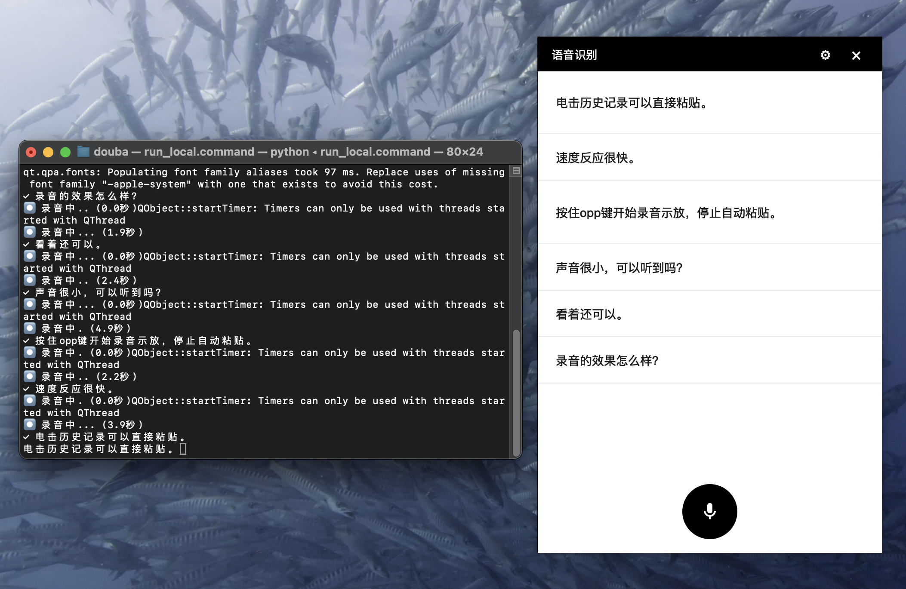

# Wispr Flow CN

Wispr Flow CN 是一个基于 FunASR 的实时语音识别应用，提供简洁现代的用户界面和高效的语音转文字功能。



## 特性

- 🎙️ 实时语音识别：支持实时录音并转换为文字
- 📝 历史记录：自动保存识别结果，方便查看和复制
- ⚡ 快捷操作：支持空格键快速开始/停止录音
- 🎯 高频词优化：支持添加高频词以提高识别准确率
- 🎨 现代界面：简洁美观的用户界面，支持深色/浅色主题
- 🔍 智能纠错：自动优化识别结果中的常见错误

## 安装

### 环境要求

- Python 3.10 或更高版本
- PyQt6
- FunASR
- PyAudio

### 安装步骤

1. 克隆仓库：
```bash
git clone https://github.com/ttmouse/Wispr-Flow-CN.git
cd Wispr-Flow-CN
```

2. 创建虚拟环境：
```bash
python -m venv py310
source py310/bin/activate  # Linux/Mac
# 或
.\py310\Scripts\activate  # Windows
```

3. 安装依赖：
```bash
pip install -r requirements.txt
```

## 使用方法

1. 启动应用：
```bash
python src/main.py
```

2. 基本操作：
   - 点击麦克风按钮或按空格键开始录音
   - 再次点击或按空格键停止录音
   - 点击历史记录可以复制文本
   - 点击设置按钮可以配置高频词

## 配置说明

### 高频词设置

1. 点击右上角的设置按钮（⚙）
2. 在设置窗口中输入高频词，每行一个
3. 点击保存即可生效

## 开发说明

### 项目结构

```
src/
├── main.py              # 主程序入口
├── speech_recognition.py # 语音识别模块
├── state_manager.py     # 状态管理
└── ui/                  # 用户界面
    ├── main_window.py   # 主窗口
    ├── settings_window.py # 设置窗口
    └── components/      # UI组件
        ├── modern_button.py
        └── modern_list.py
```

### 技术栈

- 语音识别：FunASR (ModelScope)
- 界面框架：PyQt6
- 音频处理：PyAudio
- 模型：Paraformer-large

## 许可证

本项目采用 MIT 许可证。详见 [LICENSE](LICENSE) 文件。

## 贡献指南

欢迎提交 Issue 和 Pull Request。在提交 PR 之前，请确保：

1. 代码风格符合项目规范
2. 添加了必要的测试
3. 更新了相关文档

## 致谢

- [FunASR](https://github.com/alibaba-damo-academy/FunASR)：提供了强大的语音识别能力
- [ModelScope](https://www.modelscope.cn/)：提供了优秀的模型资源
- [PyQt6](https://www.riverbankcomputing.com/software/pyqt/)：提供了现代的 GUI 框架

## 更新日志

### v1.0.0 (2024-01-01)
- 初始版本发布
- 支持实时语音识别
- 支持历史记录管理
- 支持高频词配置 